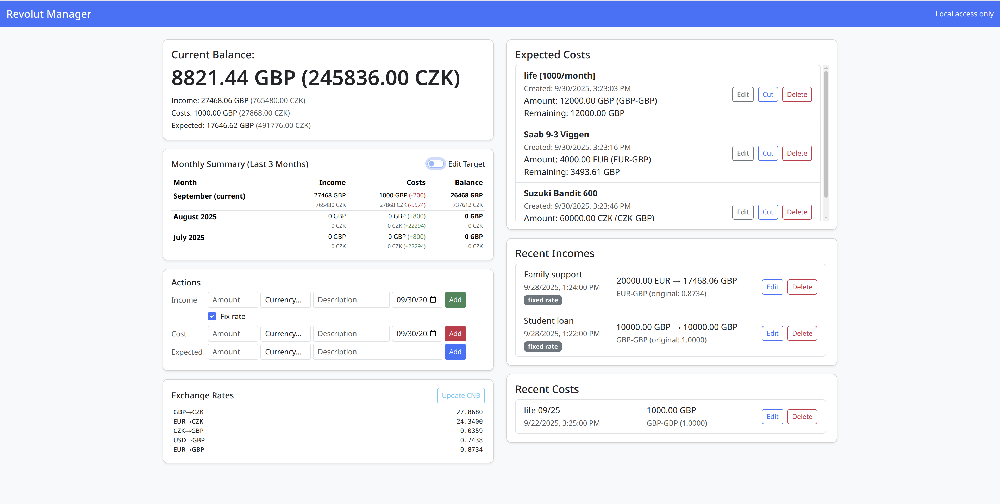

# Revolut Manager
Simple Python Flask app to maintain private incomes and costs (together with expected future costs) in order to know that you are running out of money before actually running out of money!

## Features
Calculates current account balance based on the following transactions:
- incomes
- costs
- expected costs

Supports FX rates as well, therefore the incomes and expected costs can be defined both in CZK and GBP. The base currency is GBP, therefore if CZK is entered, the current rate is applied.
Dynamical update of the CZK->GBP rate is supported, however, therefore the actual balance (with respect to the GBP) is always recalculated.

## Preview

